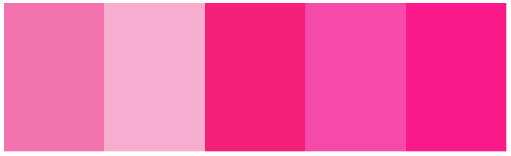

<p align="center">

</p>

# XcodeTheme-Rapha.cc
Xcode theme inspired by Rapha.cc 🚴‍♀️colors

## Install:

* Clone
```console
$ git clone https://github.com/robertherdzik/XcodeTheme-Rapha.cc.git
```

* Create custom themes folder:
```console
$ mkdir -p ~/Library/Developer/Xcode/UserData/FontAndColorThemes/
```

* Copy theme to ~/Library/Developer/Xcode/UserData/FontAndColorThemes/ forlder OR create symbolic link:
```console
$ ln -s Rapha.cc.xccolortheme ~/Library/Developer/Xcode/UserData/FontAndColorThemes/Rapha.cc.xccolortheme
```

---

## Overview
<p align="center">

</p>

---

_img source: www.rapha.cc_

## Inspiration
<p align="center">


</p>

---
