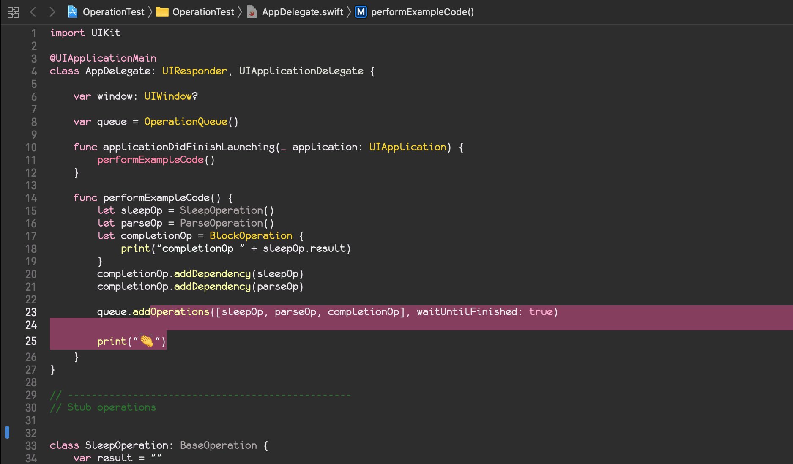

# XcodeTheme-Rapha.cc
Xcode theme inspired by Rapha.cc 🚴‍♀️colors

##Install:

* Clone
```console
$ git clone https://github.com/robertherdzik/XcodeTheme-Rapha.cc.git
```

* Create custom themes folder:
```console
$ mkdir -p ~/Library/Developer/Xcode/UserData/FontAndColorThemes/
```

* Copy theme to ~/Library/Developer/Xcode/UserData/FontAndColorThemes/ forlder

---
## Owerview
<p align="center">

</p>

---
_img source: www.rapha.cc_

## Inspiration
<p align="center">


</p>
---